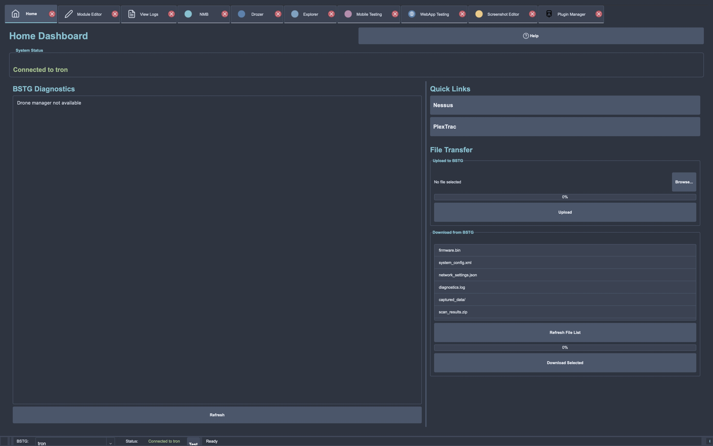
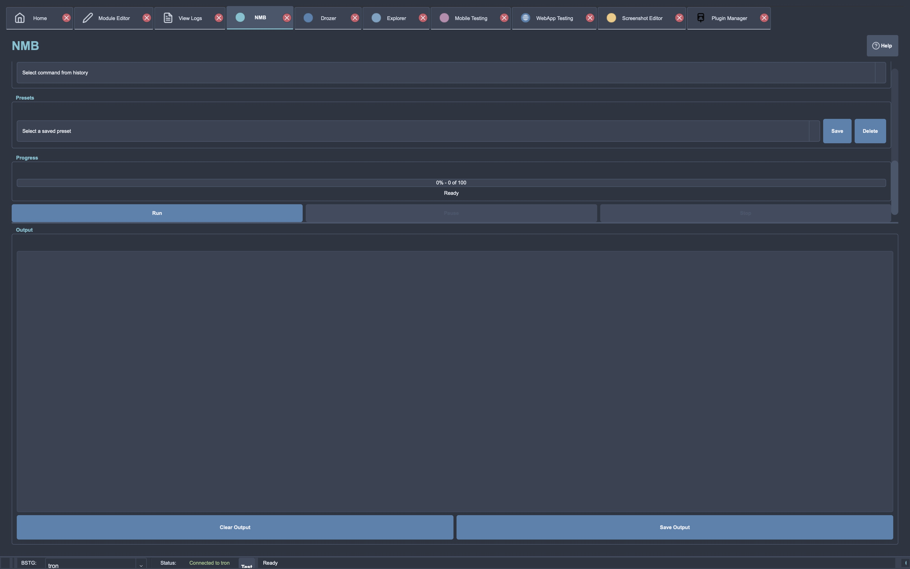
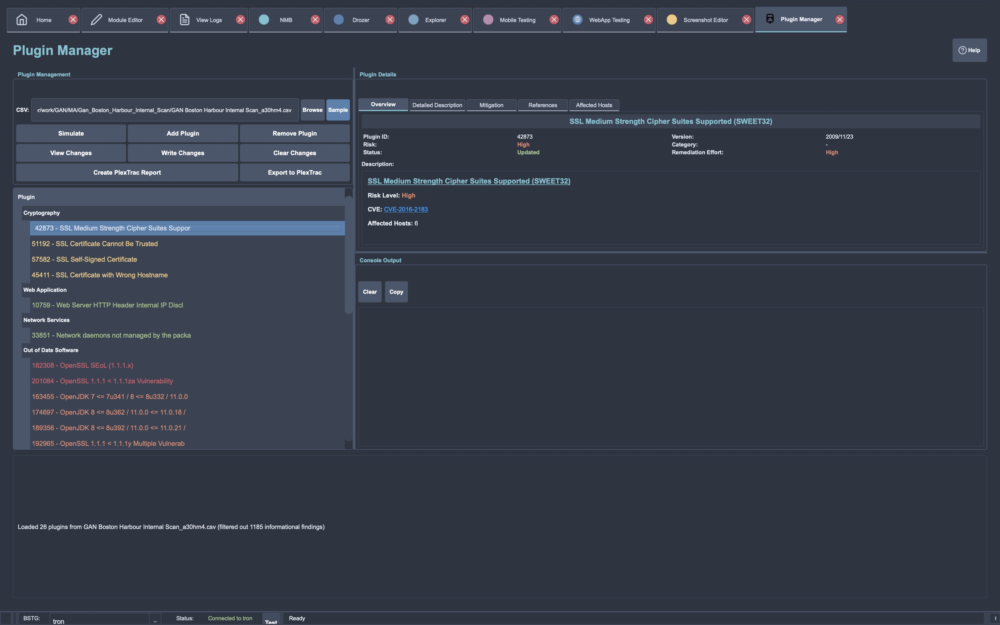
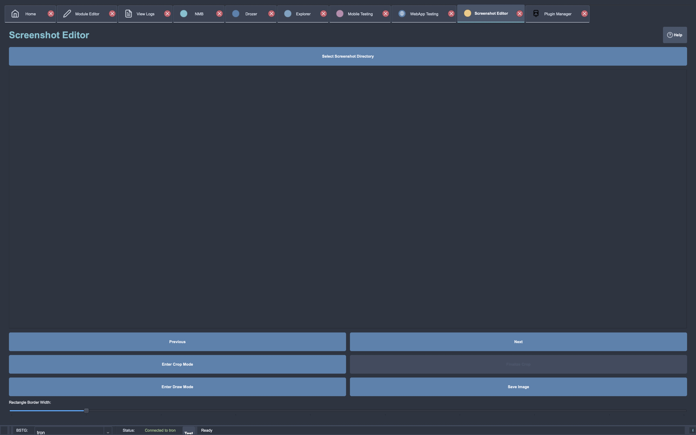
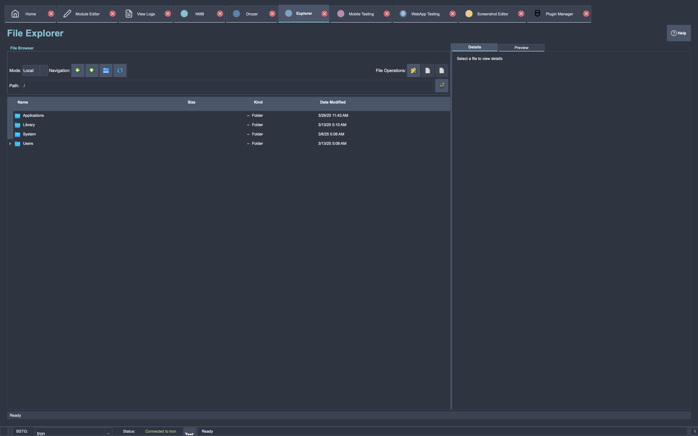
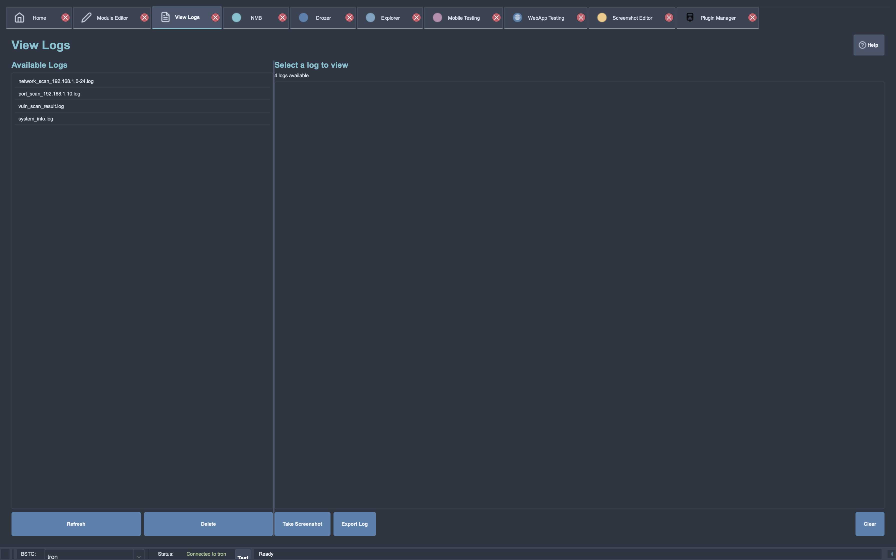
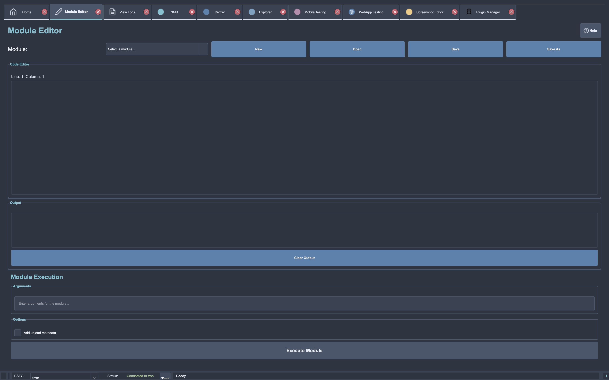
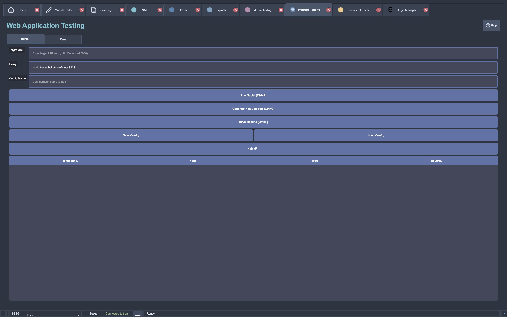
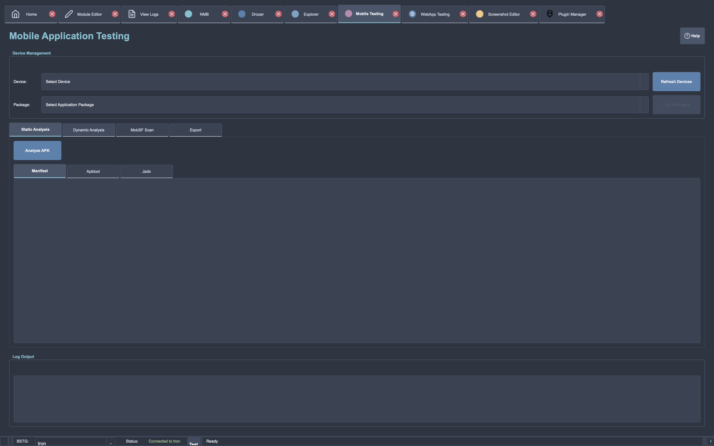
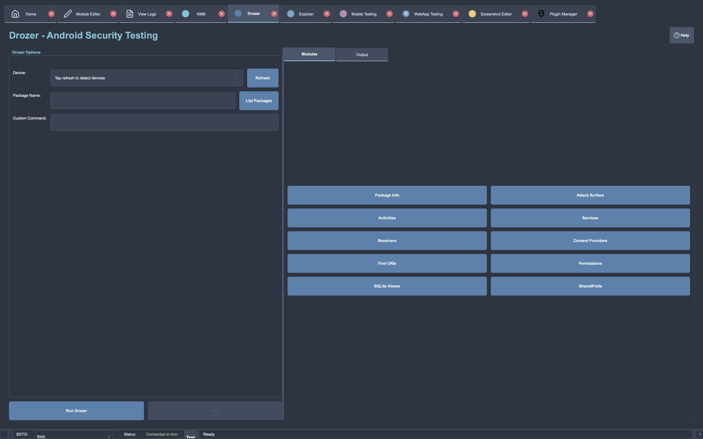

# BSTI Toolset

> **Original implementation by Connor Fancy**  
> This is a refactored version of the original BSTI toolset. Full credit for the original design and implementation goes to Connor Fancy.

## 📍 Overview

The BSTI (Bulletproof SI) Toolset provides a suite of utilities designed to streamline and manage security assessment workflows, primarily focusing on Nessus vulnerability scanning and integration with Plextrac reporting. It combines functionalities for scan deployment, management, result processing, and reporting into a cohesive system.

The primary interface is now the refactored GUI application (`bsti_refactored.py`), offering a modular and user-friendly experience. Command-line tools and modules for specific tasks like Nessus management (`nmb.py`) and Nessus-to-Plextrac conversion (`bsti-nessus`) are also part of the toolset.

## 🚀 Installation

### Quick Installation

```bash
# Clone the repository
git clone <repository_url>
cd <repository_directory>

# Run the installation script (Linux/macOS)
bash install.sh

# Or on Windows
install.bat
```

### Detailed Installation Guide

For complete installation instructions, including platform-specific requirements, troubleshooting, and alternative installation methods, see our [Detailed Installation Guide](README_INSTALL.md).

### Key Installation Steps

1. Ensure you have **Python 3.8+** installed
2. Set up a virtual environment (recommended)
3. Install the package with `pip install -e .`
4. Configure your drone connections
5. Run the setup tools to verify installation

For troubleshooting common installation issues, please refer to the [Detailed Installation Guide](README_INSTALL.md#troubleshooting).

---

## ✨ Key Features

*   **Unified GUI**: Modern interface (`bsti_refactored.py`) integrating various functionalities.
*   **Nessus Scan Management (NMB)**:
    *   Full lifecycle management: Deploy, Create, Launch, Pause, Resume, Monitor, Export.
    *   Support for different policy scopes (core, non-core, custom).
    *   Target list and exclusion file handling.
    *   Optional discovery scans.
*   **Nessus to Plextrac Conversion**:
    *   Convert Nessus CSV exports to Plextrac format.
    *   Upload findings and associated screenshots to Plextrac.
    *   Filter duplicate findings.
    *   Smart categorization based on configurable plugin definitions.
    *   Plugin Manager for interactive or automated categorization refinement.
*   **Security Assessment Modules**:
    *   Support for Internal and External assessment workflows.
    *   Integration with Nmap for network scanning.
    *   Manual finding verification steps.
    *   Report generation capabilities.
*   **Enhanced User Experience**:
    *   **Configuration Wizard**: Interactive setup for Nessus, Plextrac, and general settings.
    *   **Secure Credential Management**: Store credentials securely using platform-specific mechanisms (Keychain, Credential Manager, Secret Service).
    *   **Progress Tracking**: Real-time progress bars with ETA for long-running operations.
    *   **Parallel Processing**: Speed up tasks like scanning, parsing, and uploading using multi-threading/multi-processing.

---

## 🖥️ GUI Interface

BSTI offers a comprehensive GUI with multiple specialized tabs for different security assessment tasks. Here's a look at the main components:

### Home Tab
The starting point for navigation with quick access to all features and recent activities.



### Nessus Management Buddy (NMB) Tab
Manage the complete lifecycle of Nessus scans from creation to export.



### Plugin Manager Tab
Review and categorize Nessus findings before uploading to Plextrac.



### Screenshot Editor Tab
Capture, edit, and manage screenshots for vulnerability documentation.



### Explorer Tab
Browse and manage files and resources during security assessments.



### View Logs Tab
Monitor and analyze logs for debugging and audit purposes.



### Module Editor Tab
Create and modify custom assessment modules and workflows.



### Web App Testing Tab
Specialized tools for web application penetration testing.



### Mobile App Testing Tab
Features for testing mobile applications on different platforms.



### Drozer Tab
Integration with Drozer for Android application security testing.



---

## 🚀 Quick Start

### Prerequisites

*   Python 3.8+ (check specific tool requirements if using older components directly)
*   Access to Nessus Scanner(s)
*   Access to a Plextrac instance (for conversion/upload features)
*   Required Python packages (see `requirements.txt`)

### Installation

1.  **Clone the repository:**
    ```bash
    git clone <repository_url>
    cd <repository_directory>
    ```
2.  **Install dependencies:**
    ```bash
    pip install -r requirements.txt
    ```
3.  **Run platform-specific setup (if available/needed):**
    ```bash
    # Linux/macOS
    chmod +x install.sh && ./install.sh

    # Windows
    .\install.bat
    ```
    *(Note: Check if `install.sh`/`.bat` scripts exist and are relevant for the combined toolset)*

### Basic Usage

#### Setting Up Drone Connections (New Feature)

The new drone configuration manager makes it easy to set up and reuse drone connections:

1. **Run the drone setup wizard:**
   ```bash
   python setup_drone.py --wizard
   ```

2. **Follow the prompts** to enter drone name, hostname/IP, username, and password.

3. **Use your saved drone** in any command by specifying just the name:
   ```bash
   python nmb.py -d your_drone_name -m test-connection
   ```

4. **Manage your drone configurations:**
   ```bash
   # List all configured drones
   python setup_drone.py --list
   
   # Test a drone connection
   python setup_drone.py --test your_drone_name
   
   # Delete a drone configuration
   python setup_drone.py --delete your_drone_name
   ```

#### Main GUI Application (Recommended)

1.  **Launch the application:**
    ```bash
    python bsti_refactored.py
    ```
2.  **Connect to a drone/scanner** using the connection options within the GUI.
3.  **Navigate through tabs** to access different features (Scan Management, Plextrac Export, etc.).

#### Plugin Manager (for Nessus-to-Plextrac)

Use the Plugin Manager to review and categorize Nessus findings before uploading to Plextrac.

1.  **Run interactively:**
    ```bash
    python bsti_refactored.py --plugin-manager
    ```
    *   Follow prompts to load a Nessus CSV and manage plugin categories.

2.  **Run via command-line actions:**
    ```bash
    # Example: Add specific plugin IDs to the 'SSH' category
    python bsti_refactored.py --plugin-manager --action add_plugin --category "SSH" --plugin-ids "10881,10862,90317"

    # Example: Write changes to the configuration
    python bsti_refactored.py --plugin-manager --action write_changes
    ```

#### Configuration Wizard

Run the wizard to configure connections and settings interactively:
```bash
# For NMB settings (if applicable)
python nmb.py --config-wizard

# For Nessus-to-Plextrac settings (if applicable)
bsti-nessus --config-wizard

# Check if bsti_refactored.py has its own wizard entry point
# python bsti_refactored.py --config-wizard (Example, verify command)
```

#### Command-Line Tools (Legacy/Specific Use)

While the GUI is recommended, individual tools might still be used:

*   **Nessus Management Buddy (NMB):**
    ```bash
    python nmb.py -m <MODE> [OPTIONS...]
    # Example: Deploy a scan
    python nmb.py -m deploy -d nessus.example.com -c client_project -s core --targets-file targets.txt
    ```
    *   Modes: `deploy`, `create`, `launch`, `pause`, `resume`, `monitor`, `export`, `external`, `internal`, `regen`

*   **BSTI Nessus-to-Plextrac Converter:**
    ```bash
    bsti-nessus [OPTIONS...]
    # Example: Convert and upload
    bsti-nessus -u user -p pass -d ./nessus_files -t plextrac_instance --client MyClient --report ReportName
    ```

---

## 📚 Documentation & Examples

*   **Primary Documentation:** https://pages.kevlar.bulletproofsi.net/iss-cs-team/delivery-toolset/BSTI/
*   **Refactored App Usage:** [docs/bsti_refactored_usage.md](docs/bsti_refactored_usage.md)
*   **Command Reference:** [bsti_refactored_commands.md](bsti_refactored_commands.md) or `man -l bsti-refactored.1`
*   **NMB README:** [nmb_README.md](nmb_README.md)
*   **Nessus-to-Plextrac README:** [bsti_nessus/README.md](bsti_nessus/README.md)

---

## 🔧 Troubleshooting

*   **Safe Mode:** If the main GUI fails, try launching in safe mode:
    ```bash
    python bsti_refactored.py --safe-mode
    ```
*   **Dependencies:** Ensure all packages in `requirements.txt` are installed correctly in your Python environment.
*   **Configuration:** Verify that configuration files (e.g., `NMB_config.json`, `config/config.json`) exist and are correctly formatted.
*   **Permissions:** Check for necessary file system permissions (e.g., writing to temp directories, reading input files).
*   **Connectivity:** Ensure network connectivity to Nessus scanners and Plextrac instances.

---

## 🤝 Contributing

*(Optional: Add guidelines for contributing if this is an open project or internal team project where contributions are expected)*

---

## 📜 License

*(Optional: Add license information, e.g., MIT, Apache 2.0, Proprietary)*

---

## Recent Updates

### New Drone Configuration Management
- Added new tools for easier drone connection management
- Store and reuse drone connection details (hostname, username, password)
- Simple setup wizard for guided drone configuration
- Access saved drone configurations using just the drone name
- Two easy ways to use:
  - Interactive: `python setup_drone.py --wizard`
  - Command-line: `python nmb.py --drone-config wizard`
- Use saved configurations with: `python nmb.py -d drone_name -m test-connection`

### New Refactored Entry Point
- A new refactored entry point `bsti_refactored.py` is now available
- Provides a more modular and maintainable codebase
- Includes command-line options for the plugin manager and safe mode
- See [bsti_refactored_commands.md](bsti_refactored_commands.md) for quick command reference
- Full documentation available at [docs/bsti_refactored_usage.md](docs/bsti_refactored_usage.md)

### Test Coverage Improvements
- Added comprehensive unit tests for the progress reporting module (92% code coverage)
- Fixed method name mismatches in the configuration wizard and credential management modules
- Increased overall test coverage from 19% to 22%

### Testing
The project includes a dedicated `tests` directory with all test files. To run tests:

```bash
# Run all tests
./run_tests.sh

# Run tests with verbose output
./run_tests.sh -v

# Run only specific types of tests
./run_tests.sh --skip-ui  # Skip UI component tests
./run_tests.sh --skip-nmb  # Skip NMB tests
./run_tests.sh --skip-module  # Skip module system tests

# Run a specific test file
./run_tests.sh -t tests/test_nmb.py

# Generate coverage reports
./run_tests.sh --html  # Generate HTML coverage report
```

For more information, see the [tests/README.md](tests/README.md) file.

### Implementation Status
- See the [implementation.md](implementation.md) file for detailed status of all components
- Current focus: fixing integration tests and improving test coverage


